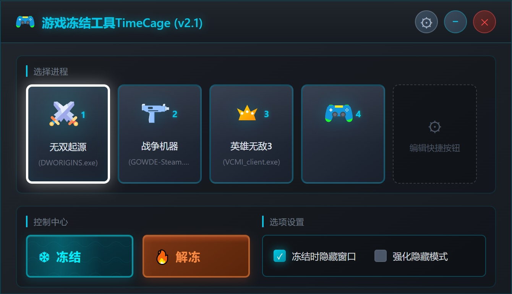

# 游戏冻结工具 TimeCage ⏸️

一个现代化的Windows游戏进程冻结工具，支持暂停和恢复游戏进程，帮助您更好地管理游戏资源。

## 🖼️ 预览

<p align="center">
  
</p>

## ✨ 功能特性

- **进程冻结/解冻** - 通过 `NtSuspendProcess` / `NtResumeProcess` 高效管理进程
- **快捷按钮配置** - 支持最多4个快捷按钮，可配置进程名、描述和图标
- **老板键** - 支持全局热键，一键冻结/解冻当前选中的游戏
- **配置持久化** - 自动保存配置到 `%AppData%\Roaming\TimeCage\`
- **窗口控制** - 冻结时可选择隐藏/显示进程窗口（普通/增强模式）
- **系统托盘** - 支持最小化到托盘，托盘图标右键菜单
- **单实例运行** - 自动检测并激活已运行的实例
- **开机自启** - 支持开机自动启动（可配置）
- **现代化UI** - 基于 WebView2 + HTML/CSS/JS 的科技感深色界面
- **DPI自适应** - 自动根据系统DPI缩放窗口尺寸

## 🛠️ 技术栈

- **开发语言**: C++ (MFC框架)
- **UI技术**: HTML + CSS + JavaScript (WebView2)
- **依赖库**:
  - [Microsoft.Web.WebView2](https://www.nuget.org/packages/Microsoft.Web.WebView2) - 现代浏览器引擎
  - [Microsoft.Windows.ImplementationLibrary](https://www.nuget.org/packages/Microsoft.Windows.ImplementationLibrary) - Windows API封装
  - [nlohmann/json](https://github.com/nlohmann/json) - JSON解析库

## 📁 项目结构

```
TimeCage/
├── TimeCage/
│   ├── TimeCageDlg.h/.cpp         # 主对话框，业务逻辑核心
│   ├── WebView2Manager.h/.cpp     # WebView2控件管理
│   ├── ConfigManager.h/.cpp       # 配置文件管理 (INI)
│   ├── MyProcessHelper.h/.cpp     # 进程操作辅助类
│   ├── BossKeyManager.h/.cpp     # 老板键（全局热键）管理
│   ├── define.h                   # 常量定义
│   └── Index.html                 # 前端界面
├── TimeCage.sln                   # Visual Studio解决方案
└── Bin/                           # 编译输出目录
```

## 🚀 快速开始

### 系统要求

- Windows 10 1809 或更高版本
- Visual Studio 2022 (用于编译)
- [WebView2 Runtime](https://developer.microsoft.com/zh-cn/microsoft-edge/webview2/) (通常已预装)

### 编译步骤

1. 克隆或下载本仓库
2. 使用 Visual Studio 2022 打开 `TimeCage.sln`
3. 选择 `Release` 配置和 `x64` 平台
4. 点击 **生成解决方案**
5. 编译好的可执行文件在 `Bin/` 目录

### 使用方法

1. 运行 `TimeCage.exe`
2. 点击编辑快捷按钮，配置游戏进程名（如 `game.exe`）
3. 选择要冻结的游戏
4. 点击 **❄️ 冻结** 按钮暂停游戏
5. 需要恢复时点击 **🔥 解冻**
6. 按下配置的老板键可一键切换冻结/解冻状态

### 老板键

在设置中启用老板键，配置组合键（如 `Ctrl+Shift+F1`）。按下老板键将自动冻结/解冻当前选中的游戏进程。

支持的组合键格式：`Ctrl/Shift/Alt/Win + 字母/F1-F12/方向键/功能键`

### 快捷按钮

支持配置4个快捷按钮，每个按钮包含：
- **进程名**: 游戏的可执行文件名（如 `game.exe`）
- **描述**: 按钮显示的文字说明
- **图标索引**: 按钮使用的图标编号

## 📝 配置文件

配置文件保存在 `%AppData%\Roaming\TimeCage\Config.ini`

格式示例：
```ini
[Shortcut1]
ProcessName=game.exe
Comment=我的游戏
IconIndex=0

[Shortcut2]
ProcessName=game2.exe
Comment=游戏2
IconIndex=1

[Settings]
HideWindow=1
HideWindowEnhanced=0
SingleInstance=1
MinimizeToTray=1
BossKeyEnabled=1
BossKey=Ctrl+Shift+F1
AutoStart=0
LastSelShortButtonIndex=0
```

配置项说明：
| 键名 | 说明 |
|------|------|
| `HideWindow` | 冻结时自动隐藏窗口 |
| `HideWindowEnhanced` | 增强模式：隐藏进程所有窗口 |
| `SingleInstance` | 单实例运行 |
| `MinimizeToTray` | 关闭时最小化到托盘 |
| `BossKeyEnabled` | 启用老板键 |
| `BossKey` | 老板键组合键 |
| `AutoStart` | 开机自动启动 |
| `LastSelShortButtonIndex` | 最后选择的快捷按钮 |

## 🤝 贡献

欢迎提交 Issue 和 Pull Request！

## 📄 许可证

本项目仅供学习和交流使用。

---

**注意**: 本工具通过暂停进程工作，请谨慎使用，避免数据丢失。
